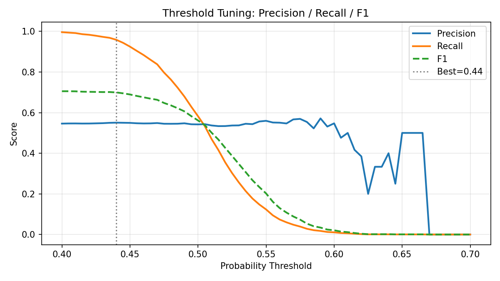
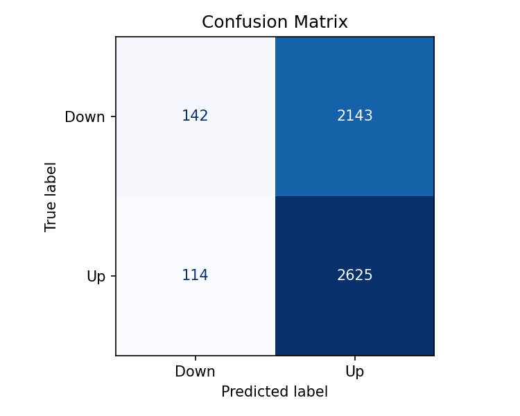
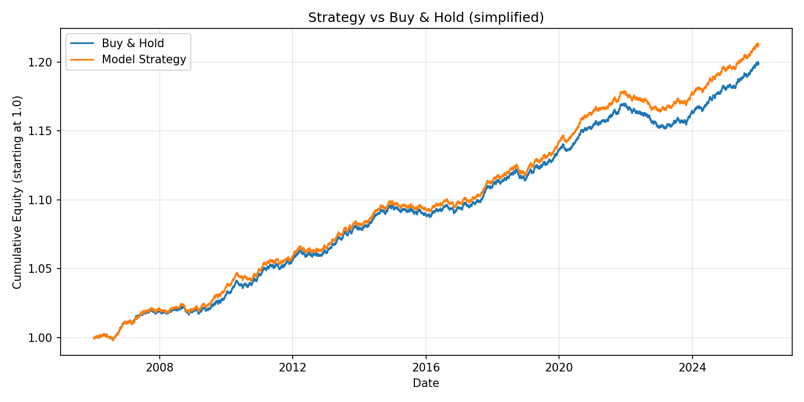

# S&P 500 Market Predictor

A Python ML project that predicts whether the S&P 500 will close **up or down** on the next trading day using a Random Forest classifier trained on 25+ years of historical data.

Built with proper time-series methodology: **no data leakage**, chronological expanding-window backtesting, and probability threshold tuning.

## Quick Start

```bash
# Clone and set up
git clone https://github.com/arorazk/sp500-market-predictor.git
cd sp500-market-predictor
pip install -r requirements.txt

# Run the full pipeline
python main.py
```

The script downloads data, engineers features, runs the backtest, tunes the threshold, and saves charts to `./outputs/`.

For an interactive walkthrough, open [`notebooks/demo.ipynb`](notebooks/demo.ipynb).

## Results

Backtest over **5,024 out-of-sample trading days** (2006–2025) across **80 quarterly retraining folds**:

| Metric | Value | Baseline |
|---|---|---|
| Accuracy | **55.1%** | 54.5% (majority class) |
| Precision | **55.1%** | — |
| Recall | 95.8% | — |
| F1 | 69.9% | — |
| AUC-ROC | 49.8% | 50.0% (random) |
| Optimal threshold | 0.44 | 0.50 (default) |

> **Honest interpretation**: The model predicts "up" very aggressively (95.8% recall) and achieves a precision marginally above the majority-class baseline — consistent with what the literature says about daily equity direction prediction. AUC-ROC near 0.50 confirms the signal is weak. This is expected; the value of this project is in the methodology, not the alpha.

### Output Charts

<table>
  <tr>
    <td><br><em>Threshold sweep: precision, recall, F1 vs threshold (0.40–0.70)</em></td>
    <td><br><em>Confusion matrix at optimal threshold (0.44)</em></td>
  </tr>
  <tr>
    <td colspan="2"><br><em>Simplified strategy equity curve vs buy-and-hold (no transaction costs)</em></td>
  </tr>
</table>

## Project Structure

```
sp500-market-predictor/
├── notebooks/
│   └── demo.ipynb       # Interactive walkthrough of the full pipeline
├── src/
│   ├── data_loader.py   # Download & clean OHLCV data from Yahoo Finance
│   ├── features.py      # Leakage-safe feature engineering
│   ├── model.py         # RandomForestClassifier configuration
│   ├── backtest.py      # Expanding-window walk-forward engine
│   └── evaluate.py      # Metrics, threshold tuning, charts
├── outputs/             # Generated charts (committed for reference)
├── main.py              # Orchestration entry point
├── requirements.txt
└── README.md
```

## Methodology

### Data

- **Source**: Yahoo Finance via `yfinance` (`^GSPC`)
- **Range**: January 2000 – December 2025 (~6,500 trading days)
- **Target**: Binary — 1 if next day's close > today's close, 0 otherwise

### Features (11 total, all leakage-safe)

| Category | Features |
|------------|--------------------------------------------------------|
| Returns | 1-day, 5-day, 10-day, 21-day log returns |
| Momentum | RSI-14, MACD signal delta |
| Volatility | 10-day and 21-day rolling std of daily returns |
| Trend | SMA 50/200 ratio, price-to-52-week-high ratio |
| Volume | 10-day / 21-day average volume ratio |

Every feature is **shifted forward by 1 day** before training so that row *t* uses only information available before day *t*'s close.

### Backtesting

- **Method**: Expanding-window walk-forward
- **Initial training window**: ~5 years (1,260 trading days)
- **Step size**: 63 days (~1 quarter)
- **No shuffle**: Strict chronological ordering preserved throughout
- **Retraining**: Full retrain at each fold on all available history

### Model

- `RandomForestClassifier` with `max_depth=8`, `min_samples_leaf=50`, `class_weight="balanced"`
- Probability threshold tuned by sweeping 0.40–0.70 and selecting the threshold that maximises precision with recall ≥ 0.20

## What I Learned

1. **Data leakage is subtle.** The biggest mistake in financial ML is accidentally using future data during training. I spent a lot of time making sure each feature was properly shifted so that the model at time *t* only sees information available *before* day *t*'s close.

2. **Walk-forward backtesting is the only honest evaluation method for time-series.** A standard `train_test_split` would give falsely optimistic results because financial markets are non-stationary — patterns shift over time. Quarterly retraining forces the model to generalise across market regimes (dot-com crash, 2008 GFC, COVID, etc.).

3. **AUC-ROC near 0.50 is normal for daily equity prediction.** The efficient market hypothesis means most short-term price movements are close to random. The project taught me to calibrate expectations and focus on rigorous methodology rather than chasing high metrics on in-sample data.

4. **The threshold matters more than the model.** By tuning the probability threshold I could trade off precision vs. recall meaningfully. At 0.44, the model captures almost all up-days (recall 95.8%) but at low precision — useful as a filter, not a standalone signal.

5. **Modular code pays off quickly.** Splitting data loading, feature engineering, model training, backtesting, and evaluation into separate modules made it easy to swap out pieces (e.g. trying different feature sets) without touching the rest of the pipeline.

## Honest Limitations

Daily equity direction is one of the hardest prediction problems in ML. Expect:

- **Precision around 55%** — a few points above the ~54.5% majority-class baseline
- **AUC-ROC near 0.50** — the signal is weak but non-random in a specific regime
- **No transaction costs** modelled in the equity curve

This project demonstrates rigorous ML methodology, not a profitable trading strategy.

## Resume Bullets

> - Built end-to-end ML pipeline predicting S&P 500 daily direction on 25+ years of market data using Random Forest with 11 engineered features and expanding-window backtesting across 80 quarterly retraining folds
> - Implemented leakage-safe feature engineering (RSI, MACD, rolling volatility, trend ratios) with proper temporal shifting to prevent look-ahead bias
> - Designed walk-forward backtesting engine with quarterly retraining, probability threshold tuning, and automated evaluation producing precision, AUC-ROC, and equity curve analysis

## Future Improvements

1. **Macro features** — add VIX, 10-year Treasury yield, and dollar index for market regime context
2. **Gradient boosting** — swap Random Forest for LightGBM or XGBoost, which typically improve AUC by 3–5% on financial tabular data
3. **Walk-forward hyperparameter tuning** — use `sklearn.model_selection.TimeSeriesSplit` inside each backtest fold for nested cross-validation

## License

MIT
